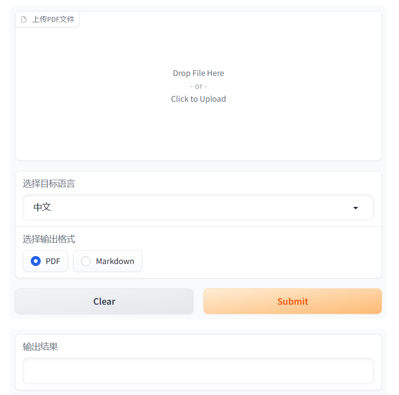

# OpenAI-Translator

<p align="center">
    <br> <a href="README.md"> English </a> | 中文
</p>
<p align="center">
    <em>所有的代码和文档完全由 OpenAI 的 GPT-4 模型生成</em>
</p>

## 介绍

OpenAI 翻译器是一个使用 AI 技术将英文 PDF 书籍翻译成中文的工具。这个工具使用了大型语言模型 (LLMs)，如 ChatGLM 和 OpenAI 的 GPT-3 以及 GPT-3.5 Turbo 来进行翻译。它是用 Python 构建的，并且具有灵活、模块化和面向对象的设计。

## 为什么做这个项目

在现今的环境中，缺乏非商业而且有效的 PDF 翻译工具。很多用户有包含敏感数据的 PDF 文件，他们更倾向于不将其上传到公共商业服务网站，以保护隐私。这个项目就是为了解决这个问题，为需要翻译他们的 PDF 文件同时又要保护数据隐私的用户提供解决方案。

## 示例结果

OpenAI 翻译器目前还处于早期开发阶段，我正在积极地添加更多功能和改进其性能。我们非常欢迎任何反馈或贡献！


<p align="center">
    <em>"老人与海"</em>
</p>

## 特性

- [X] 使用大型语言模型 (LLMs) 将英文 PDF 书籍翻译成中文。
- [X] 支持 ChatGLM 和 OpenAI 模型。
- [X] 通过 YAML 文件或命令行参数灵活配置。
- [X] 对健壮的翻译操作进行超时和错误处理。
- [X] 模块化和面向对象的设计，易于定制和扩展。
- [X] 实现图形用户界面 (GUI) 以便更易于使用。
- [ ] 添加对多个 PDF 文件的批处理支持。
- [ ] 创建一个网络服务或 API，以便在网络应用中使用。
- [X] 添加对其他语言和翻译方向的支持。
- [X] 添加对保留源 PDF 的原始布局和格式的支持。
- [ ] 通过使用自定义训练的翻译模型来提高翻译质量。

## 缺陷

鉴于PDF格式的固有复杂性，尽管已努力优化，但本工具在处理某些PDF内容时仍存在限制：

- 翻译准确性：尽管OpenAI翻译器基于GPT模型，拥有强大的翻译能力。但不能保证对所有语言都能达到100%的翻译准确性。

- 格式一致性：虽然翻译后的文档试图尽量保持与原文档相似，但依然存在差异，主要体现在字体样式与表格样式的差异上。

- 图像支持：当前版本不支持PDF中的图像翻译。

- 扫描文档支持：经过扫描的PDF文件可能无法被正确识别和翻译。

作为用户，应当明确这是一个工具，虽然它在多数场景下都非常有用，但并不能完全替代专业的翻译软件或服务。

## 开始使用

### 环境准备

1.克隆仓库 `git clone https://github.com/carrotProgrammer/OPENAI_TRANSLATOR.git`。

2.OpenAI-翻译器 需要 Python 3.6 或更高版本。使用 `pip install -r requirements.txt` 安装依赖项。

3.设置您的 OpenAI API 密钥(`$OPENAI_API_KEY`)或 ChatGLM 模型 URL(`$GLM_MODEL_URL`)。您可以将其添加到环境变量中，或者在 config.yaml 文件中指定。

### 使用示例

您可以通过指定配置文件或提供命令行参数来使用 OpenAI-翻译器。

#### 使用配置文件

根据您的设置调整 `config.yaml` 文件：

```yaml
OpenAIModel:
  model: "gpt-3.5-turbo"
  api_key: "your_openai_api_key"

GLMModel:
  model_url: "your_chatglm_model_url"
  timeout: 300

common:
  book: "test/your_book.pdf"
  file_format: "markdown"
```
#### 运行方式

GUI运行(推荐)：

```bash
python ai_translator/main.py --model_type OpenAIModel --gui
```



#### 使用命令行参数

您也可以直接在命令行上指定设置。这是使用 OpenAI 模型的例子：

```bash
# 将您的 api_key 设置为环境变量
export OPENAI_API_KEY="sk-xxx"
python main.py --model_type OpenAIModel --api_key $OPENAI_API_KEY --book your_book.pdf 
```

这是使用 GLM 模型的例子：

```bash
# 将您的 GLM 模型 URL 设置为环境变量
export GLM_MODEL_URL="http://xxx:xx"
python main.py --model_type GLMModel --glm_model_url $GLM_MODEL_URL --book your_book.pdf 
```

## 许可证

该项目采用 GPL-3.0 许可证。有关详细信息，请查看 [LICENSE](LICENSE) 文件。


